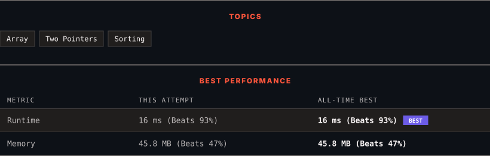

<div align="center">

# 18. 4Sum

      

[](https://leetcode.com/problems/4sum/)

</div>

---

<div align="center">

<picture>
  <source media="(prefers-color-scheme: dark)" srcset="panel-dark.svg">
  <source media="(prefers-color-scheme: light)" srcset="panel-light.svg">
  
</picture>

</div>

> **New personal best** — Runtime improved on this submission.

### HOW IT WENT

| | |
|:--|:--|
| **Attempts** | 3 before accepted |
| **Time to solve** | 4 min |
| **Verdicts** | ✅ Accepted → ✅ Accepted → ✅ Accepted |

---

### NOTES

_No notes yet._

---

### SOLUTIONS (1)

| # | File | Language | Date |
|:-:|------|:--------:|:----:|
| 1 | [sol1.java](./sol1.java) | `Java` | 2026-09-23 ← **latest** |

---

### PROBLEM DESCRIPTION

Given an array `nums` of `n` integers, return *an array of all the **unique** quadruplets* `[nums[a], nums[b], nums[c], nums[d]]` such that:

	- `0 <= a, b, c, d < n`

	- `a`, `b`, `c`, and `d` are **distinct**.

	- `nums[a] + nums[b] + nums[c] + nums[d] == target`

You may return the answer in **any order**.

 

**Example 1:**

```

**Input:** nums = [1,0,-1,0,-2,2], target = 0
**Output:** [[-2,-1,1,2],[-2,0,0,2],[-1,0,0,1]]

```

**Example 2:**

```

**Input:** nums = [2,2,2,2,2], target = 8
**Output:** [[2,2,2,2]]

```

 

**Constraints:**

	- `1 <= nums.length <= 200`

	- `-10^9 <= nums[i] <= 10^9`

	- `-10^9 <= target <= 10^9`

---

<div align="center">

<sub>Auto-synced by <strong>LeetSync</strong> · Built by <a href="https://deveshsamant.in/">Devesh Samant</a></sub>

</div>
