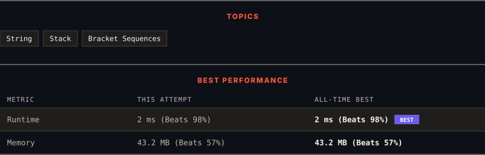

# 20. Valid Parentheses

      

---

<picture>
  <source media="(prefers-color-scheme: dark)" srcset="panel-dark.svg">
  <source media="(prefers-color-scheme: light)" srcset="panel-light.svg">
  
</picture>

> **New personal best** — Runtime improved on this submission.

### HOW IT WENT

| | |
|:--|:--|
| **Attempts** | first try |
| **Time to solve** | 1 min |
| **Verdicts** | ✅ Accepted |

---

### NOTES

_No notes yet._

---

### SOLUTIONS (1)

| # | File | Language | Date |
|:-:|------|:--------:|:----:|
| 1 | [sol1.java](./sol1.java) | `Java` | 2026-09-24 ← **latest** |

---

### PROBLEM DESCRIPTION

Given a string `s` containing just the characters `'('`, `')'`, `'{'`, `'}'`, `'['` and `']'`, determine if the input string is valid.

An input string is valid if:

	- Open brackets must be closed by the same type of brackets.

	- Open brackets must be closed in the correct order.

	- Every close bracket has a corresponding open bracket of the same type.

 

**Example 1:**

**Input:** s = "()"

**Output:** true

**Example 2:**

**Input:** s = "()[]{}"

**Output:** true

**Example 3:**

**Input:** s = "(]"

**Output:** false

**Example 4:**

**Input:** s = "([])"

**Output:** true

**Example 5:**

**Input:** s = "([)]"

**Output:** false

 

**Constraints:**

	- `1 <= s.length <= 10^4`

	- `s` consists of parentheses only `'()[]{}'`.

---

Auto-synced by <strong>LeetSync</strong> · Built by <a href="https://deveshsamant.in/">Devesh Samant</a>

