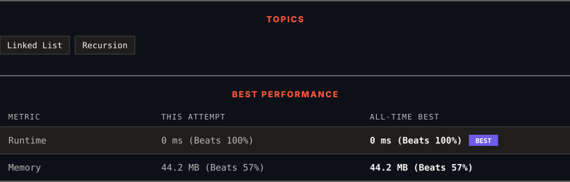

<div align="center">

# 21. Merge Two Sorted Lists

      

[](https://leetcode.com/problems/merge-two-sorted-lists/)

</div>

---

<div align="center">

<picture>
  <source media="(prefers-color-scheme: dark)" srcset="panel-dark.svg">
  <source media="(prefers-color-scheme: light)" srcset="panel-light.svg">
  
</picture>

</div>

> **New personal best** — Runtime improved on this submission.

### HOW IT WENT

| | |
|:--|:--|
| **Attempts** | first try |
| **Time to solve** | 2 min |
| **Verdicts** | ✅ Accepted |

---

### NOTES

_No notes yet._

---

### SOLUTIONS (1)

| # | File | Language | Date |
|:-:|------|:--------:|:----:|
| 1 | [sol1.java](./sol1.java) | `Java` | 2026-09-25 ← **latest** |

---

### PROBLEM DESCRIPTION

You are given the heads of two sorted linked lists `list1` and `list2`.

Merge the two lists into one **sorted** list. The list should be made by splicing together the nodes of the first two lists.

Return *the head of the merged linked list*.

 

**Example 1:**


```

**Input:** list1 = [1,2,4], list2 = [1,3,4]
**Output:** [1,1,2,3,4,4]

```

**Example 2:**

```

**Input:** list1 = [], list2 = []
**Output:** []

```

**Example 3:**

```

**Input:** list1 = [], list2 = [0]
**Output:** [0]

```

 

**Constraints:**

	- The number of nodes in both lists is in the range `[0, 50]`.

	- `-100 <= Node.val <= 100`

	- Both `list1` and `list2` are sorted in **non-decreasing** order.

---

<div align="center">

<sub>Auto-synced by <strong>LeetSync</strong> · Built by <a href="https://deveshsamant.in/">Devesh Samant</a></sub>

</div>
