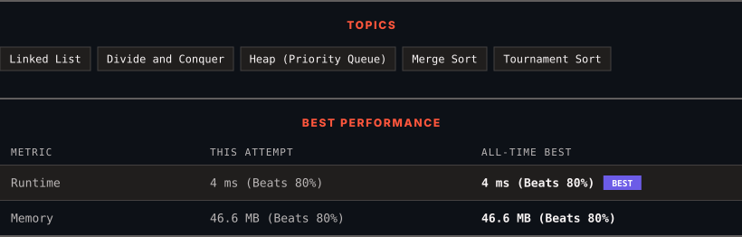

<div align="center">

# 23. Merge k Sorted Lists

      

[](https://leetcode.com/problems/merge-k-sorted-lists/)

</div>

---

<div align="center">

<picture>
  <source media="(prefers-color-scheme: dark)" srcset="panel-dark.svg">
  <source media="(prefers-color-scheme: light)" srcset="panel-light.svg">
  
</picture>

</div>

> **New personal best** — Runtime improved on this submission.

### HOW IT WENT

| | |
|:--|:--|
| **Attempts** | first try |
| **Time to solve** | 6 min |
| **Verdicts** | ✅ Accepted |

---

### NOTES

_No notes yet._

---

### SOLUTIONS (1)

| # | File | Language | Date |
|:-:|------|:--------:|:----:|
| 1 | [sol1.java](./sol1.java) | `Java` | 2026-09-26 ← **latest** |

---

### PROBLEM DESCRIPTION

You are given an array of `k` linked-lists `lists`, each linked-list is sorted in ascending order.

*Merge all the linked-lists into one sorted linked-list and return it.*

 

**Example 1:**

```

**Input:** lists = [[1,4,5],[1,3,4],[2,6]]
**Output:** [1,1,2,3,4,4,5,6]
**Explanation:** The linked-lists are:
[
  1->4->5,
  1->3->4,
  2->6
]
merging them into one sorted linked list:
1->1->2->3->4->4->5->6

```

**Example 2:**

```

**Input:** lists = []
**Output:** []

```

**Example 3:**

```

**Input:** lists = [[]]
**Output:** []

```

 

**Constraints:**

	- `k == lists.length`

	- `0 <= k <= 10^4`

	- `0 <= lists[i].length <= 500`

	- `-10^4 <= lists[i][j] <= 10^4`

	- `lists[i]` is sorted in **ascending order**.

	- The sum of `lists[i].length` will not exceed `10^4`.

---

<div align="center">

<sub>Auto-synced by <strong>LeetSync</strong> · Built by <a href="https://deveshsamant.in/">Devesh Samant</a></sub>

</div>
