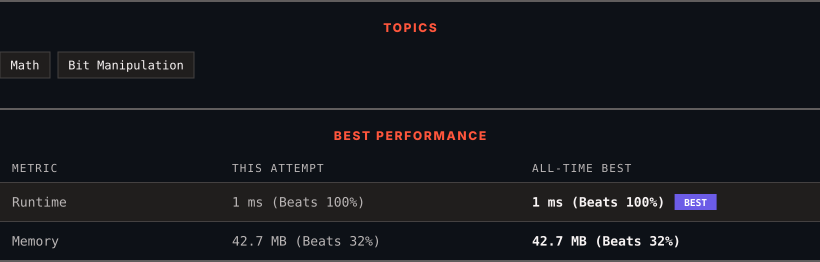

<div align="center">

# 29. Divide Two Integers

      

[](https://leetcode.com/problems/divide-two-integers/)

</div>

---

<div align="center">

<picture>
  <source media="(prefers-color-scheme: dark)" srcset="panel-dark.svg">
  <source media="(prefers-color-scheme: light)" srcset="panel-light.svg">
  
</picture>

</div>

> **New personal best** — Runtime improved on this submission.

### HOW IT WENT

| | |
|:--|:--|
| **Attempts** | first try |
| **Time to solve** | 1 min |
| **Verdicts** | ✅ Accepted |

---

### NOTES

_No notes yet._

---

### SOLUTIONS (1)

| # | File | Language | Date |
|:-:|------|:--------:|:----:|
| 1 | [sol1.java](./sol1.java) | `Java` | 2026-09-26 ← **latest** |

---

### PROBLEM DESCRIPTION

Given two integers `dividend` and `divisor`, divide two integers **without** using multiplication, division, and mod operator.

The integer division should truncate toward zero, which means losing its fractional part. For example, `8.345` would be truncated to `8`, and `-2.7335` would be truncated to `-2`.

Return *the **quotient** after dividing *`dividend`* by *`divisor`.

**Note: **Assume we are dealing with an environment that could only store integers within the **32-bit** signed integer range: `[−2^31, 2^31 − 1]`. For this problem, if the quotient is **strictly greater than** `2^31 - 1`, then return `2^31 - 1`, and if the quotient is **strictly less than** `-2^31`, then return `-2^31`.

 

**Example 1:**

```

**Input:** dividend = 10, divisor = 3
**Output:** 3
**Explanation:** 10/3 = 3.33333.. which is truncated to 3.

```

**Example 2:**

```

**Input:** dividend = 7, divisor = -3
**Output:** -2
**Explanation:** 7/-3 = -2.33333.. which is truncated to -2.

```

 

**Constraints:**

	- `-2^31 <= dividend, divisor <= 2^31 - 1`

	- `divisor != 0`

---

<div align="center">

<sub>Auto-synced by <strong>LeetSync</strong> · Built by <a href="https://deveshsamant.in/">Devesh Samant</a></sub>

</div>
