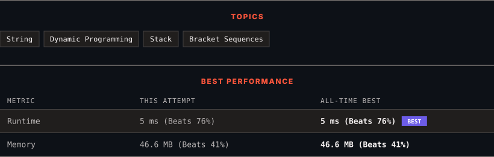

<div align="center">

# 32. Longest Valid Parentheses

      

[](https://leetcode.com/problems/longest-valid-parentheses/)

</div>

---

<div align="center">

<picture>
  <source media="(prefers-color-scheme: dark)" srcset="panel-dark.svg">
  <source media="(prefers-color-scheme: light)" srcset="panel-light.svg">
  
</picture>

</div>

> **New personal best** — Runtime improved on this submission.

### HOW IT WENT

| | |
|:--|:--|
| **Attempts** | first try |
| **Time to solve** | under a minute |
| **Verdicts** | ✅ Accepted |

---

### NOTES

_No notes yet._

---

### SOLUTIONS (1)

| # | File | Language | Date |
|:-:|------|:--------:|:----:|
| 1 | [sol1.java](./sol1.java) | `Java` | 2026-09-28 ← **latest** |

---

### PROBLEM DESCRIPTION

Given a string containing just the characters `'('` and `')'`, return *the length of the longest valid (well-formed) parentheses **substring*.

 

**Example 1:**

```

**Input:** s = "(()"
**Output:** 2
**Explanation:** The longest valid parentheses substring is "()".

```

**Example 2:**

```

**Input:** s = ")()())"
**Output:** 4
**Explanation:** The longest valid parentheses substring is "()()".

```

**Example 3:**

```

**Input:** s = ""
**Output:** 0

```

 

**Constraints:**

	- `0 <= s.length <= 3 * 10^4`

	- `s[i]` is `'('`, or `')'`.

---

<div align="center">

<sub>Auto-synced by <strong>LeetSync</strong> · Built by <a href="https://deveshsamant.in/">Devesh Samant</a></sub>

</div>
