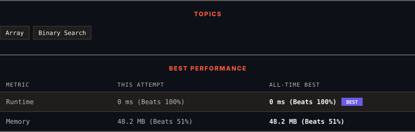

<div align="center">

# 34. Find First and Last Position of Element in Sorted Array

      

[](https://leetcode.com/problems/find-first-and-last-position-of-element-in-sorted-array/)

</div>

---

<div align="center">

<picture>
  <source media="(prefers-color-scheme: dark)" srcset="panel-dark.svg">
  <source media="(prefers-color-scheme: light)" srcset="panel-light.svg">
  
</picture>

</div>

> **New personal best** — Runtime improved on this submission.

### HOW IT WENT

| | |
|:--|:--|
| **Attempts** | first try |
| **Time to solve** | 3 min |
| **Verdicts** | ✅ Accepted |

---

### NOTES

_No notes yet._

---

### SOLUTIONS (1)

| # | File | Language | Date |
|:-:|------|:--------:|:----:|
| 1 | [sol1.java](./sol1.java) | `Java` | 2026-10-07 ← **latest** |

---

### PROBLEM DESCRIPTION

Given an array of integers `nums` sorted in non-decreasing order, find the starting and ending position of a given `target` value.

If `target` is not found in the array, return `[-1, -1]`.

You must write an algorithm with `O(log n)` runtime complexity.

 

**Example 1:**

```
**Input:** nums = [5,7,7,8,8,10], target = 8
**Output:** [3,4]

```

**Example 2:**

```
**Input:** nums = [5,7,7,8,8,10], target = 6
**Output:** [-1,-1]

```

**Example 3:**

```
**Input:** nums = [], target = 0
**Output:** [-1,-1]

```

 

**Constraints:**

	- `0 <= nums.length <= 10^5`

	- `-10^9 <= nums[i] <= 10^9`

	- `nums` is a non-decreasing array.

	- `-10^9 <= target <= 10^9`

---

<div align="center">

<sub>Auto-synced by <strong>LeetSync</strong> · Built by <a href="https://deveshsamant.in/">Devesh Samant</a></sub>

</div>
