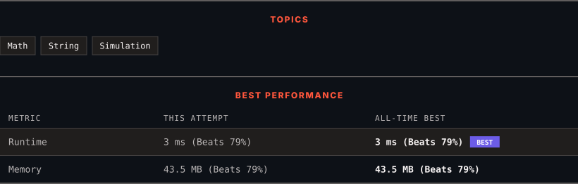

<div align="center">

# 43. Multiply Strings

      

[](https://leetcode.com/problems/multiply-strings/)

</div>

---

<div align="center">

<picture>
  <source media="(prefers-color-scheme: dark)" srcset="panel-dark.svg">
  <source media="(prefers-color-scheme: light)" srcset="panel-light.svg">
  
</picture>

</div>

> **New personal best** — Runtime improved on this submission.

### HOW IT WENT

| | |
|:--|:--|
| **Attempts** | first try |
| **Time to solve** | under a minute |
| **Verdicts** | ✅ Accepted |

---

### NOTES

_No notes yet._

---

### SOLUTIONS (1)

| # | File | Language | Date |
|:-:|------|:--------:|:----:|
| 1 | [sol1.java](./sol1.java) | `Java` | 2026-10-10 ← **latest** |

---

### PROBLEM DESCRIPTION

Given two non-negative integers `num1` and `num2` represented as strings, return the product of `num1` and `num2`, also represented as a string.

**Note:** You must not use any built-in BigInteger library or convert the inputs to integer directly.

 

**Example 1:**

```
**Input:** num1 = "2", num2 = "3"
**Output:** "6"

```

**Example 2:**

```
**Input:** num1 = "123", num2 = "456"
**Output:** "56088"

```

 

**Constraints:**

	- `1 <= num1.length, num2.length <= 200`

	- `num1` and `num2` consist of digits only.

	- Both `num1` and `num2` do not contain any leading zero, except the number `0` itself.

---

<div align="center">

<sub>Auto-synced by <strong>LeetSync</strong> · Built by <a href="https://deveshsamant.in/">Devesh Samant</a></sub>

</div>
