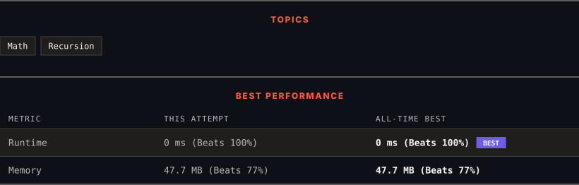

<div align="center">

# 50. Pow(x, n)

      

[](https://leetcode.com/problems/powx-n/)

</div>

---

<div align="center">

<picture>
  <source media="(prefers-color-scheme: dark)" srcset="panel-dark.svg">
  <source media="(prefers-color-scheme: light)" srcset="panel-light.svg">
  
</picture>

</div>

> **New personal best** — Runtime improved on this submission.

### HOW IT WENT

| | |
|:--|:--|
| **Attempts** | first try |
| **Time to solve** | 1 min |
| **Verdicts** | ✅ Accepted |

---

### NOTES

_No notes yet._

---

### SOLUTIONS (1)

| # | File | Language | Date |
|:-:|------|:--------:|:----:|
| 1 | [sol1.java](./sol1.java) | `Java` | 2026-09-26 ← **latest** |

---

### PROBLEM DESCRIPTION

Implement [pow(x, n)](http://www.cplusplus.com/reference/valarray/pow/), which calculates `x` raised to the power `n` (i.e., `x^n`).

 

**Example 1:**

```

**Input:** x = 2.00000, n = 10
**Output:** 1024.00000

```

**Example 2:**

```

**Input:** x = 2.10000, n = 3
**Output:** 9.26100

```

**Example 3:**

```

**Input:** x = 2.00000, n = -2
**Output:** 0.25000
**Explanation:** 2^-2 = 1/2^2 = 1/4 = 0.25

```

 

**Constraints:**

	- `-100.0 < x < 100.0`

	- `-2^31 <= n <= 2^31-1`

	- `n` is an integer.

	- Either `x` is not zero or `n > 0`.

	- `-10^4 <= x^n <= 10^4`

---

<div align="center">

<sub>Auto-synced by <strong>LeetSync</strong> · Built by <a href="https://deveshsamant.in/">Devesh Samant</a></sub>

</div>
