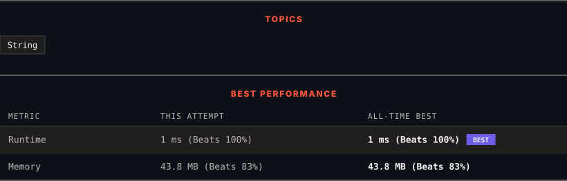

# 65. Valid Number

      

---

<picture>
  <source media="(prefers-color-scheme: dark)" srcset="panel-dark.svg">
  <source media="(prefers-color-scheme: light)" srcset="panel-light.svg">
  
</picture>

> **New personal best** — Runtime improved on this submission.

### HOW IT WENT

| | |
|:--|:--|
| **Attempts** | first try |
| **Time to solve** | 1 min |
| **Verdicts** | ✅ Accepted |

---

### NOTES

_No notes yet._

---

### SOLUTIONS (1)

| # | File | Language | Date |
|:-:|------|:--------:|:----:|
| 1 | [sol1.java](./sol1.java) | `Java` | 2026-10-08 ← **latest** |

---

### PROBLEM DESCRIPTION

Given a string `s`, return whether `s` is a **valid number**.

For example, all the following are valid numbers: `"2", "0089", "-0.1", "+3.14", "4.", "-.9", "2e10", "-90E3", "3e+7", "+6e-1", "53.5e93", "-123.456e789"`, while the following are not valid numbers: `"abc", "1a", "1e", "e3", "99e2.5", "--6", "-+3", "95a54e53"`.

Formally, a **valid number** is defined using one of the following definitions:

	- An **integer number** followed by an **optional exponent**.

	- A **decimal number** followed by an **optional exponent**.

An **integer number** is defined with an **optional sign** `'-'` or `'+'` followed by **digits**.

A **decimal number** is defined with an **optional sign** `'-'` or `'+'` followed by one of the following definitions:

	- **Digits** followed by a **dot** `'.'`.

	- **Digits** followed by a **dot** `'.'` followed by **digits**.

	- A **dot** `'.'` followed by **digits**.

An **exponent** is defined with an **exponent notation** `'e'` or `'E'` followed by an **integer number**.

The **digits** are defined as one or more digits.

 

**Example 1:**

**Input:** s = "0"

**Output:** true

**Example 2:**

**Input:** s = "e"

**Output:** false

**Example 3:**

**Input:** s = "."

**Output:** false

 

**Constraints:**

	- `1 <= s.length <= 20`

	- `s` consists of only English letters (both uppercase and lowercase), digits (`0-9`), plus `'+'`, minus `'-'`, or dot `'.'`.

---

Auto-synced by <strong>LeetSync</strong> · Built by <a href="https://deveshsamant.in/">Devesh Samant</a>

