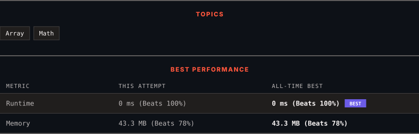

<div align="center">

# 66. Plus One

      

[](https://leetcode.com/problems/plus-one/)

</div>

---

<div align="center">

<picture>
  <source media="(prefers-color-scheme: dark)" srcset="panel-dark.svg">
  <source media="(prefers-color-scheme: light)" srcset="panel-light.svg">
  
</picture>

</div>

> **New personal best** — Runtime improved on this submission.

### HOW IT WENT

| | |
|:--|:--|
| **Attempts** | first try |
| **Time to solve** | 7 min |
| **Verdicts** | ✅ Accepted |

---

### NOTES

_No notes yet._

---

### SOLUTIONS (1)

| # | File | Language | Date |
|:-:|------|:--------:|:----:|
| 1 | [sol1.java](./sol1.java) | `Java` | 2026-10-09 ← **latest** |

---

### PROBLEM DESCRIPTION

You are given a **large integer** represented as an integer array `digits`, where each `digits[i]` is the `i^th` digit of the integer. The digits are ordered from most significant to least significant in left-to-right order. The large integer does not contain any leading `0`'s.

Increment the large integer by one and return *the resulting array of digits*.

 

**Example 1:**

```

**Input:** digits = [1,2,3]
**Output:** [1,2,4]
**Explanation:** The array represents the integer 123.
Incrementing by one gives 123 + 1 = 124.
Thus, the result should be [1,2,4].

```

**Example 2:**

```

**Input:** digits = [4,3,2,1]
**Output:** [4,3,2,2]
**Explanation:** The array represents the integer 4321.
Incrementing by one gives 4321 + 1 = 4322.
Thus, the result should be [4,3,2,2].

```

**Example 3:**

```

**Input:** digits = [9]
**Output:** [1,0]
**Explanation:** The array represents the integer 9.
Incrementing by one gives 9 + 1 = 10.
Thus, the result should be [1,0].

```

 

**Constraints:**

	- `1 <= digits.length <= 100`

	- `0 <= digits[i] <= 9`

	- `digits` does not contain any leading `0`'s.

---

<div align="center">

<sub>Auto-synced by <strong>LeetSync</strong> · Built by <a href="https://deveshsamant.in/">Devesh Samant</a></sub>

</div>
