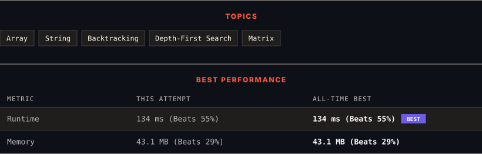

<div align="center">

# 79. Word Search

      

[](https://leetcode.com/problems/word-search/)

</div>

---

<div align="center">

<picture>
  <source media="(prefers-color-scheme: dark)" srcset="panel-dark.svg">
  <source media="(prefers-color-scheme: light)" srcset="panel-light.svg">
  
</picture>

</div>

> **New personal best** — Runtime improved on this submission.

### HOW IT WENT

| | |
|:--|:--|
| **Attempts** | first try |
| **Time to solve** | 1 min |
| **Verdicts** | ✅ Accepted |

---

### NOTES

_No notes yet._

---

### SOLUTIONS (1)

| # | File | Language | Date |
|:-:|------|:--------:|:----:|
| 1 | [sol1.java](./sol1.java) | `Java` | 2026-09-27 ← **latest** |

---

### PROBLEM DESCRIPTION

Given an `m x n` grid of characters `board` and a string `word`, return `true` *if* `word` *exists in the grid*.

The word can be constructed from letters of sequentially adjacent cells, where adjacent cells are horizontally or vertically neighboring. The same letter cell may not be used more than once.

 

**Example 1:**


```

**Input:** board = [["A","B","C","E"],["S","F","C","S"],["A","D","E","E"]], word = "ABCCED"
**Output:** true

```

**Example 2:**


```

**Input:** board = [["A","B","C","E"],["S","F","C","S"],["A","D","E","E"]], word = "SEE"
**Output:** true

```

**Example 3:**


```

**Input:** board = [["A","B","C","E"],["S","F","C","S"],["A","D","E","E"]], word = "ABCB"
**Output:** false

```

 

**Constraints:**

	- `m == board.length`

	- `n = board[i].length`

	- `1 <= m, n <= 6`

	- `1 <= word.length <= 15`

	- `board` and `word` consists of only lowercase and uppercase English letters.

 

**Follow up:** Could you use search pruning to make your solution faster with a larger `board`?

---

<div align="center">

<sub>Auto-synced by <strong>LeetSync</strong> · Built by <a href="https://deveshsamant.in/">Devesh Samant</a></sub>

</div>
