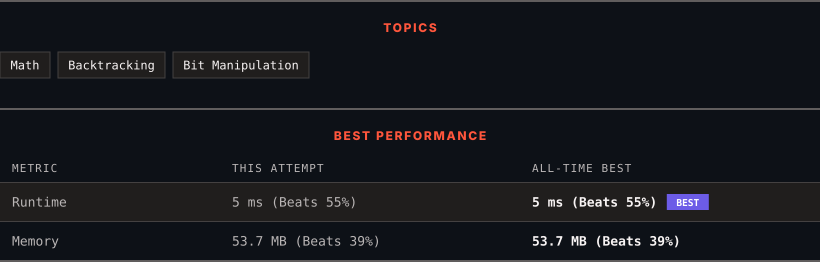

<div align="center">

# 89. Gray Code

      

[](https://leetcode.com/problems/gray-code/)

</div>

---

<div align="center">

<picture>
  <source media="(prefers-color-scheme: dark)" srcset="panel-dark.svg">
  <source media="(prefers-color-scheme: light)" srcset="panel-light.svg">
  
</picture>

</div>

> **New personal best** — Runtime improved on this submission.

### HOW IT WENT

| | |
|:--|:--|
| **Attempts** | first try |
| **Time to solve** | 1 min |
| **Verdicts** | ✅ Accepted |

---

### NOTES

_No notes yet._

---

### SOLUTIONS (1)

| # | File | Language | Date |
|:-:|------|:--------:|:----:|
| 1 | [sol1.java](./sol1.java) | `Java` | 2026-09-29 ← **latest** |

---

### PROBLEM DESCRIPTION

An **n-bit gray code sequence** is a sequence of `2^n` integers where:

	- Every integer is in the **inclusive** range `[0, 2^n - 1]`,

	- The first integer is `0`,

	- An integer appears **no more than once** in the sequence,

	- The binary representation of every pair of **adjacent** integers differs by **exactly one bit**, and

	- The binary representation of the **first** and **last** integers differs by **exactly one bit**.

Given an integer `n`, return *any valid **n-bit gray code sequence***.

 

**Example 1:**

```

**Input:** n = 2
**Output:** [0,1,3,2]
**Explanation:**
The binary representation of [0,1,3,2] is [00,01,11,10].
- 00 and 01 differ by one bit
- 01 and 11 differ by one bit
- 11 and 10 differ by one bit
- 10 and 00 differ by one bit
[0,2,3,1] is also a valid gray code sequence, whose binary representation is [00,10,11,01].
- 00 and 10 differ by one bit
- 10 and 11 differ by one bit
- 11 and 01 differ by one bit
- 01 and 00 differ by one bit

```

**Example 2:**

```

**Input:** n = 1
**Output:** [0,1]

```

 

**Constraints:**

	- `1 <= n <= 16`

---

<div align="center">

<sub>Auto-synced by <strong>LeetSync</strong> · Built by <a href="https://deveshsamant.in/">Devesh Samant</a></sub>

</div>
