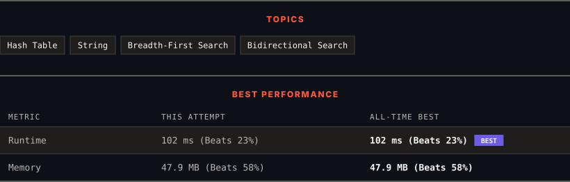

<div align="center">

# 127. Word Ladder

      

[](https://leetcode.com/problems/word-ladder/)

</div>

---

<div align="center">

<picture>
  <source media="(prefers-color-scheme: dark)" srcset="panel-dark.svg">
  <source media="(prefers-color-scheme: light)" srcset="panel-light.svg">
  
</picture>

</div>

> **New personal best** — Runtime improved on this submission.

### HOW IT WENT

| | |
|:--|:--|
| **Attempts** | first try |
| **Time to solve** | 1 min |
| **Verdicts** | ✅ Accepted |

---

### NOTES

_No notes yet._

---

### SOLUTIONS (1)

| # | File | Language | Date |
|:-:|------|:--------:|:----:|
| 1 | [sol1.java](./sol1.java) | `Java` | 2026-10-02 ← **latest** |

---

### PROBLEM DESCRIPTION

A **transformation sequence** from word `beginWord` to word `endWord` using a dictionary `wordList` is a sequence of words `beginWord -> s_1 -> s_2 -> ... -> s_k` such that:

	- Every adjacent pair of words differs by a single letter.

	- Every `s_i` for `1 <= i <= k` is in `wordList`. Note that `beginWord` does not need to be in `wordList`.

	- `s_k == endWord`

Given two words, `beginWord` and `endWord`, and a dictionary `wordList`, return *the **number of words** in the **shortest transformation sequence** from* `beginWord` *to* `endWord`*, or *`0`* if no such sequence exists.*

 

**Example 1:**

```

**Input:** beginWord = "hit", endWord = "cog", wordList = ["hot","dot","dog","lot","log","cog"]
**Output:** 5
**Explanation:** One shortest transformation sequence is "hit" -> "hot" -> "dot" -> "dog" -> cog", which is 5 words long.

```

**Example 2:**

```

**Input:** beginWord = "hit", endWord = "cog", wordList = ["hot","dot","dog","lot","log"]
**Output:** 0
**Explanation:** The endWord "cog" is not in wordList, therefore there is no valid transformation sequence.

```

 

**Constraints:**

	- `1 <= beginWord.length <= 10`

	- `endWord.length == beginWord.length`

	- `1 <= wordList.length <= 5000`

	- `wordList[i].length == beginWord.length`

	- `beginWord`, `endWord`, and `wordList[i]` consist of lowercase English letters.

	- `beginWord != endWord`

	- All the words in `wordList` are **unique**.

---

<div align="center">

<sub>Auto-synced by <strong>LeetSync</strong> · Built by <a href="https://deveshsamant.in/">Devesh Samant</a></sub>

</div>
