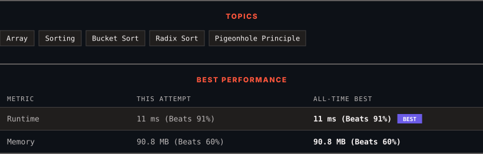

<div align="center">

# 164. Maximum Gap

      

[](https://leetcode.com/problems/maximum-gap/)

</div>

---

<div align="center">

<picture>
  <source media="(prefers-color-scheme: dark)" srcset="panel-dark.svg">
  <source media="(prefers-color-scheme: light)" srcset="panel-light.svg">
  
</picture>

</div>

> **New personal best** — Runtime improved on this submission.

### HOW IT WENT

| | |
|:--|:--|
| **Attempts** | first try |
| **Time to solve** | 2 min |
| **Verdicts** | ✅ Accepted |

---

### NOTES

_No notes yet._

---

### SOLUTIONS (1)

| # | File | Language | Date |
|:-:|------|:--------:|:----:|
| 1 | [sol1.java](./sol1.java) | `Java` | 2026-10-06 ← **latest** |

---

### PROBLEM DESCRIPTION

Given an integer array `nums`, return *the maximum difference between two successive elements in its sorted form*. If the array contains less than two elements, return `0`.

You must write an algorithm that runs in linear time and uses linear extra space.

 

**Example 1:**

```

**Input:** nums = [3,6,9,1]
**Output:** 3
**Explanation:** The sorted form of the array is [1,3,6,9], either (3,6) or (6,9) has the maximum difference 3.

```

**Example 2:**

```

**Input:** nums = [10]
**Output:** 0
**Explanation:** The array contains less than 2 elements, therefore return 0.

```

 

**Constraints:**

	- `1 <= nums.length <= 10^5`

	- `0 <= nums[i] <= 10^9`

---

<div align="center">

<sub>Auto-synced by <strong>LeetSync</strong> · Built by <a href="https://deveshsamant.in/">Devesh Samant</a></sub>

</div>
